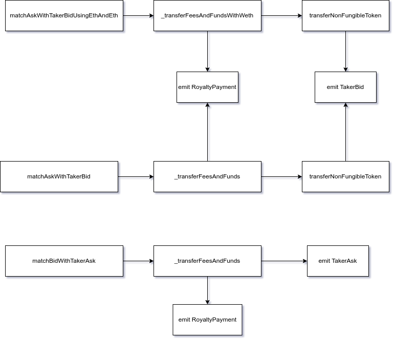

# looksrare-fees

The Subgraph should track the Events of the marketplaces, like 
- the different buys and sells as immutable records.
- more specifically the Royalty collection and fee collection. 


The subgraph should have a record of all the royalties paid for each item in the ecosystem. 
sell/buy events, and the fees it generates, and who gets those fees.

Contract
- looksrareexchange - 0x59728544B08AB483533076417FbBB2fD0B17CE3a
- start block - 13885625


Major methods to look at.
- matchAskWithTakerBidUsingETHAndWETH
- matchAskWithTakerBid
- matchBidWithTakerAsk
- _transferFeesAndFunds
- _transferFeesAndFundsWithWETH
- _transferNonFungibleToken




Possible first events to work with

- TakerAsk
- TakerBid
- RoyaltyPayment

schema
```    
collection {
    id
    address
}
users {
    id
    address
}
transactions {
    id,
    orderhash
    tx_hash
    collection
    maker
    taker
    tokenId
    price
    amount
    royaltyfee
}
royalty payments {
    collection
    tokenId
    receipient
    currency
    amount
}

```

Query 
```
{
 
  transactions(first: 10) {
    tokenId
    taker
    price
    orderNonce
    orderHash
    maker
    isTakerAsk
    id
    currency
    collection
    amount
  }
}
```